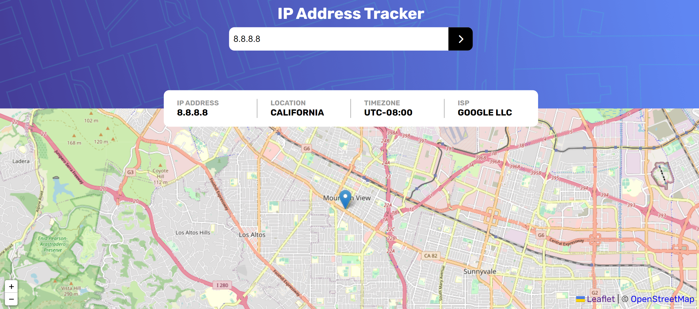

# Welcome to my challenge season! 👋

IP Address tracker en el ecosistema Vue, Vue Router, Vuex. 
Diseño responsivo he implementacion de Apis publicas.

+ [IP Geolocation API](https://geo.ipify.org/)
+ [Leaffetjs](https://leafletjs.com/)

## Ip Address Tracker



### Project setup
```
npm install
```

### Compiles and hot-reloads for development
```
npm run serve
```

### Compiles and minifies for production
```
npm run build
```

### Lints and fixes files
```
npm run lint
```
